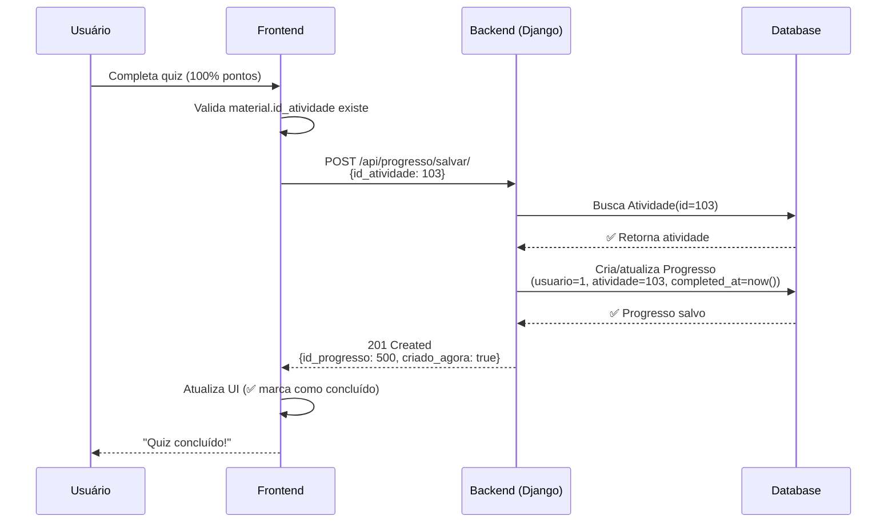
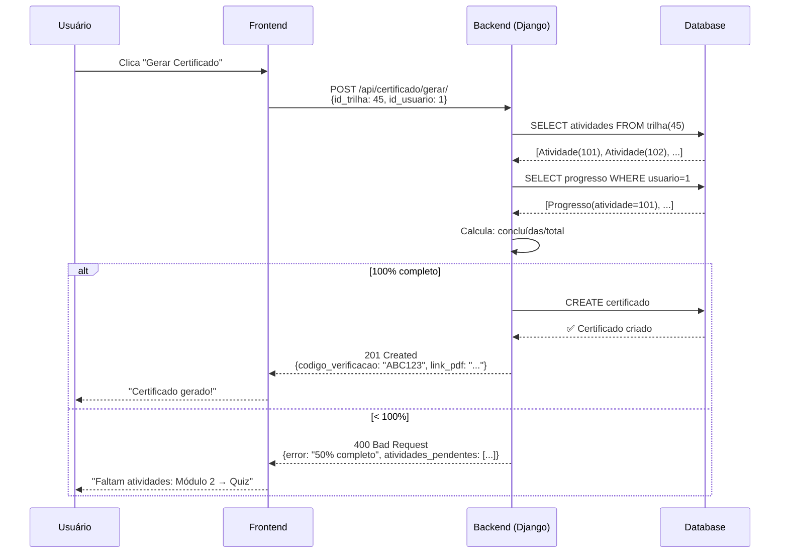

# 🔧 Correções de Progresso e Certificado

## 📋 Resumo Executivo

Identificados e corrigidos 2 problemas principais que impediam o salvamento de progresso e geração de certificados:

1. ❌ **Erro 404 ao salvar progresso**: Frontend enviava `material.id` (ID local) ao invés de `id_atividade` (ID do backend)
2. ❌ **Certificado mostrando 0%**: Materiais não geravam registros de `Progresso` por falta de mapeamento correto

---

## 🔍 Diagnóstico Detalhado

### Problema 1: Salvamento de Progresso Falhando

**Causa raiz:**
```typescript
// ❌ ANTES (INCORRETO)
const atividadeId = material.id_atividade || material.id  // fallback errado!
```

- O frontend usava `material.id` como fallback quando `material.id_atividade` era `undefined`
- `material.id` é um ID gerado localmente pelo frontend, não existe no backend
- Backend esperava `id_atividade` (chave primária da tabela `Atividade`)

**Arquitetura do backend:**
```
┌─────────────────┐
│   Atividade     │ ← Backend espera este ID
│  (id_atividade) │
└────────┬────────┘
         │ OneToOne
    ┌────┴─────────────────────────┐
    ↓                               ↓
┌──────────────┐           ┌──────────────┐
│ MaterialVideo│           │     Quiz     │
│ (id_material)│           │  (id_quiz)   │
└──────────────┘           └──────────────┘
```

**Consequências:**
- Vídeos, PDFs e materiais de leitura **não tinham** `id_atividade` definido
- Apenas quizzes funcionavam (por terem `id_atividade` mapeado)
- Erro 404: "Atividade não encontrada" ao tentar salvar progresso

---

### Problema 2: Certificado Mostrando 0% de Conclusão

**Causa raiz:**
```python
# Backend calculava conclusão baseado em registros de Progresso
for atividade in atividades:
    if Progresso.objects.filter(
        id_usuario=usuario,
        id_atividade=atividade,  # ← Só conta se tiver Progresso
        completed_at__isnull=False
    ).exists():
        atividades_concluidas += 1
```

**Problema:**
- Como materiais não geravam `Progresso` (Problema 1), o cálculo sempre retornava 0%
- Mesmo que o usuário completasse visualmente todos os itens no frontend
- Certificado rejeitava com: *"Trilha não está 100% completa. Progresso atual: 0.0%"*

---

## ✅ Correções Implementadas

### 1. Frontend - MaterialViewer.tsx

**Arquivo:** [frontend/src/components/MaterialViewer.tsx](frontend/src/components/MaterialViewer.tsx#L1184-L1230)

**Mudanças:**

```typescript
// ✅ DEPOIS (CORRETO)
const atividadeId = material.id_atividade  // Sem fallback

if (!atividadeId) {
  console.warn('⚠️ Material não possui id_atividade!')
  return  // Não tenta salvar se não tiver id_atividade
}

// Salvar com validação apropriada
const response = await fetch('http://localhost:8000/api/progresso/salvar/', {
  method: 'POST',
  headers: {
    'Authorization': `Bearer ${token}`,
    'Content-Type': 'application/json'
  },
  body: JSON.stringify({
    id_atividade: atividadeId
  })
})
```

**Impacto:**
- ✅ Valida que `id_atividade` existe antes de tentar salvar
- ✅ Logs detalhados para debug (tipo, IDs, resposta)
- ✅ Não envia mais IDs inválidos ao backend

---

### 2. Backend - views_progresso.py

**Arquivo:** [backend/onboarding_app/views_progresso.py](backend/onboarding_app/views_progresso.py#L50-L120)

**Mudanças:**

Endpoint `/api/progresso/salvar/` agora aceita **2 formatos**:

#### Opção 1: ID direto da atividade (original)
```json
POST /api/progresso/salvar/
{
  "id_atividade": 123
}
```

#### Opção 2: Via material (NOVO - fallback)
```json
POST /api/progresso/salvar/
{
  "id_material": 45,
  "tipo_material": "video"  // ou "pdf", "leitura", "quiz"
}
```

**Lógica implementada:**
```python
# Primeiro tenta buscar por id_atividade direto
if id_atividade:
    atividade = Atividade.objects.get(id_atividade=id_atividade)

# Se não encontrar, busca via material
elif id_material and tipo_material:
    if tipo_material == 'video':
        material = MaterialVideo.objects.get(id_material=id_material)
        atividade = material.id_atividade
    # ... (pdf, leitura, quiz)
```

**Impacto:**
- ✅ Suporta salvamento via `id_material` como fallback
- ✅ Busca automática da `Atividade` associada ao material
- ✅ Logs detalhados para diagnóstico
- ✅ Mensagens de erro mais claras

---

### 3. Backend - views.py (GerarCertificadoView)

**Arquivo:** [backend/onboarding_app/views.py](backend/onboarding_app/views.py#L1293-L1340)

**Mudanças:**

```python
# ✅ Logs detalhados do cálculo
print(f"🔍 Calculando conclusão da trilha {trilha.titulo}")
print(f"📚 Módulos encontrados: {modulos.count()}")

for atividade in atividades:
    progresso_existe = Progresso.objects.filter(...).exists()
    
    if progresso_existe:
        print(f"   ✅ {atividade.titulo} - CONCLUÍDA")
    else:
        print(f"   ⏳ {atividade.titulo} - PENDENTE")

print(f"📈 Percentual de conclusão: {percentual_conclusao:.1f}%")

# ✅ Resposta detalhada em caso de erro
if percentual_conclusao < 100:
    return Response({
        "error": f"Trilha não está 100% completa...",
        "atividades_concluidas": atividades_concluidas,
        "total_atividades": total_atividades,
        "atividades_pendentes": atividades_pendentes[:10]
    }, status=400)
```

**Impacto:**
- ✅ Logs detalhados de cada atividade verificada
- ✅ Resposta mostra quais atividades faltam
- ✅ Facilita debug de problemas de conclusão

---

## 🛠️ Ferramenta de Diagnóstico

**Arquivo:** [backend/diagnostico_progresso.py](backend/diagnostico_progresso.py)

Script Python para diagnosticar problemas de progresso e estrutura de dados.

### Uso:

```bash
# Diagnóstico geral (última trilha + primeiro usuário)
cd backend
python diagnostico_progresso.py

# Diagnóstico específico
python diagnostico_progresso.py --trilha 45 --usuario 1

# Marcar todas as atividades como concluídas (TESTE)
python diagnostico_progresso.py --trilha 45 --usuario 1 --marcar-concluidas
```

### O que o script faz:

1. ✅ Lista toda a estrutura da trilha (módulos → atividades → materiais)
2. ✅ Mostra IDs corretos de cada componente
3. ✅ Indica quais atividades estão concluídas (✅) vs pendentes (⏳)
4. ✅ Calcula percentual de conclusão
5. ✅ Detecta problemas comuns:
   - Atividades sem material
   - Materiais órfãos (sem atividade)
6. ✅ Utilitário para marcar atividades como concluídas (testes)

### Exemplo de saída:

```
================================================================================
🔍 DIAGNÓSTICO DE PROGRESSO E CERTIFICADOS
================================================================================

📚 TRILHA: Programação Básica (ID: 45)
👤 USUÁRIO: admin (ID: 1)

📖 ESTRUTURA DA TRILHA (3 módulos)
--------------------------------------------------------------------------------

  📖 Introdução ao Python
     Atividades: 4
     ✅ [MaterialVideo] Vídeo de Introdução (Atividade ID: 101)
        → MaterialVideo ID: 50
     ⏳ [MaterialPDF] Apostila Python (Atividade ID: 102)
        → MaterialPDF ID: 25
     ✅ [Quiz] Quiz de Python (Atividade ID: 103)
        → Quiz ID: 30

================================================================================
📊 RESUMO
================================================================================
Total de atividades: 4
Atividades concluídas: 2
Atividades pendentes: 2

📈 Percentual de conclusão: 50.0%
⏳ Faltam 2 atividades para completar a trilha
```

---

## 📐 Boas Práticas Implementadas

### 1. **Sempre usar `id_atividade` do backend**

```typescript
// ✅ BOM
if (material.id_atividade) {
  await salvarProgresso(material.id_atividade)
}

// ❌ RUIM
const id = material.id_atividade || material.id  // Fallback incorreto
```

**Por quê?**
- `material.id` é ID local do frontend (não existe no backend)
- `id_atividade` é chave primária no banco de dados
- Usar ID errado causa 404 "Atividade não encontrada"

---

### 2. **Validar presença de ID antes de salvar**

```typescript
// ✅ BOM
if (!material.id_atividade) {
  console.warn('Material sem id_atividade, não é possível salvar progresso')
  return
}
await salvarProgresso(material.id_atividade)

// ❌ RUIM
await salvarProgresso(material.id_atividade)  // Pode ser undefined
```

**Por quê?**
- Evita requisições inválidas ao backend
- Logs claros sobre o que está faltando
- Não polui logs do servidor com erros

---

### 3. **Backend deve buscar atividade via material (fallback)**

```python
# ✅ BOM - Suporta múltiplas formas de identificação
if id_atividade:
    atividade = Atividade.objects.get(id_atividade=id_atividade)
elif id_material and tipo_material:
    material = get_material(id_material, tipo_material)
    atividade = material.id_atividade

# ❌ RUIM - Apenas um formato aceito
atividade = Atividade.objects.get(id_atividade=request.data['id_atividade'])
```

**Por quê?**
- Flexibilidade para diferentes cenários
- Facilita migração de sistemas legados
- Reduz necessidade de refatoração massiva no frontend

---

### 4. **Logs detalhados para diagnóstico**

```python
# ✅ BOM
print(f"🔍 Buscando atividade {id_atividade}")
print(f"📝 Usuário: {request.user.username}")
print(f"📨 Payload: {request.data}")

try:
    atividade = Atividade.objects.get(id_atividade=id_atividade)
    print(f"✅ Atividade encontrada: {atividade.titulo}")
except Atividade.DoesNotExist:
    print(f"❌ Atividade {id_atividade} não encontrada!")
    # Listar atividades existentes para debug
    print("Atividades no banco:")
    for a in Atividade.objects.all()[:5]:
        print(f"   - {a.id_atividade}: {a.titulo}")

# ❌ RUIM
atividade = Atividade.objects.get(id_atividade=id_atividade)
```

**Por quê?**
- Facilita debug em produção
- Identifica rapidamente inconsistências de dados
- Ajuda equipe de suporte a diagnosticar problemas

---

### 5. **Respostas de erro detalhadas**

```python
# ✅ BOM
if percentual_conclusao < 100:
    return Response({
        "error": f"Trilha não está 100% completa.",
        "atividades_concluidas": atividades_concluidas,
        "total_atividades": total_atividades,
        "atividades_pendentes": ["Módulo 1 → Quiz Final", ...],
        "percentual": percentual_conclusao
    }, status=400)

# ❌ RUIM
if percentual_conclusao < 100:
    return Response({"error": "Trilha incompleta"}, status=400)
```

**Por quê?**
- Frontend pode mostrar progresso detalhado
- Usuário sabe exatamente o que falta fazer
- Reduz chamadas de suporte ("por que não consigo o certificado?")

---

### 6. **Integridade referencial entre Material ↔ Atividade**

```python
# ✅ BOM - OneToOne garante 1:1
class MaterialVideo(models.Model):
    id_atividade = models.OneToOneField(
        Atividade, 
        on_delete=models.CASCADE,  # Cascata: se apagar atividade, apaga material
        related_name="material_video"
    )

# ❌ RUIM - ForeignKey permite múltiplos materiais por atividade
id_atividade = models.ForeignKey(Atividade, ...)
```

**Por quê?**
- Garante que cada atividade tem **apenas 1 material**
- Evita ambiguidade (qual material considerar?)
- Facilita queries: `atividade.material_video` ao invés de `atividade.materiais.filter(...)`

---

## 🎯 Fluxo de Salvamento Correto (Ponta a Ponta)

### Cenário: Usuário completa um quiz



### Cenário: Usuário tenta gerar certificado



---

## 🧪 Como Testar

### 1. Teste de Salvamento de Progresso

```bash
# No terminal do backend
cd backend
python manage.py shell

# No shell do Django
from onboarding_app.models import Atividade, Progresso
from django.contrib.auth.models import User

# Criar usuário de teste
user = User.objects.first()

# Listar atividades
atividades = Atividade.objects.all()
for a in atividades[:5]:
    print(f"{a.id_atividade}: {a.titulo}")

# Verificar progresso
progresso = Progresso.objects.filter(id_usuario=user)
print(f"Usuário {user.username} tem {progresso.count()} registros de progresso")
```

### 2. Teste via Frontend

1. Faça login como usuário aprendiz
2. Abra uma trilha
3. Complete um material (vídeo, PDF ou quiz)
4. Abra DevTools (F12) → Console
5. Procure por logs:
   ```
   💾 Iniciando salvamento no backend...
   📡 Enviando POST para /api/progresso/salvar/
   ✅ Progresso salvo no backend - Atividade: 103
   ```

### 3. Teste de Diagnóstico

```bash
cd backend
python diagnostico_progresso.py --trilha 45 --usuario 1
```

Verifique a saída:
- ✅ Todas as atividades devem aparecer
- ✅ Percentual deve ser calculado corretamente
- ✅ Atividades pendentes listadas

### 4. Teste de Certificado

```bash
# Via terminal
curl -X POST http://localhost:8000/api/certificado/gerar/ \
  -H "Authorization: Bearer SEU_TOKEN" \
  -H "Content-Type: application/json" \
  -d '{"id_trilha": 45, "id_usuario": 1}'

# Resposta esperada se 100%:
{
  "codigo_verificacao": "ABC123XYZ",
  "data_emissao": "2026-01-27T10:30:00Z",
  "nome_aluno": "João Silva",
  "nome_trilha": "Programação Básica",
  "carga_horaria": 40,
  "link_pdf": "/media/certificados/ABC123XYZ.pdf",
  "criado_agora": true
}

# Resposta esperada se < 100%:
{
  "error": "Trilha não está 100% completa. Progresso atual: 75.0%",
  "atividades_concluidas": 3,
  "total_atividades": 4,
  "atividades_pendentes": [
    "Módulo 2 → Quiz Final"
  ]
}
```

---

## 🚨 Problemas Conhecidos e Soluções

### Problema: "Material não possui id_atividade"

**Sintoma:** Log `⚠️ Material não possui id_atividade!` no console

**Causa:** Material foi criado antes das correções, não tem `Atividade` associada

**Solução:**
```bash
cd backend
python manage.py shell

from onboarding_app.models import MaterialVideo, Atividade, Modulo

# Encontrar material órfão
material = MaterialVideo.objects.get(id_material=50)
print(f"Material: {material.titulo}")
print(f"Tem atividade? {material.id_atividade}")

# Criar atividade se não existir
if not material.id_atividade:
    modulo = Modulo.objects.first()  # Ajuste para o módulo correto
    atividade = Atividade.objects.create(
        id_modulo=modulo,
        titulo=material.titulo,
        descricao=material.descricao,
        ordem=1
    )
    material.id_atividade = atividade
    material.save()
    print(f"✅ Atividade {atividade.id_atividade} criada e associada")
```

---

### Problema: Certificado mostra 0% mesmo após completar todos os itens

**Sintoma:** Erro `Trilha não está 100% completa. Progresso atual: 0.0%`

**Causa:** Registros de `Progresso` não foram criados (bug anterior)

**Solução:**
```bash
# Usar script de diagnóstico
cd backend
python diagnostico_progresso.py --trilha 45 --usuario 1 --marcar-concluidas
```

⚠️ **ATENÇÃO:** Isso marca **todas** as atividades como concluídas. Use apenas para testes!

---

### Problema: Frontend não envia id_atividade

**Sintoma:** Logs mostram `material.id_atividade: undefined`

**Causa:** Material no frontend não tem campo `id_atividade` mapeado

**Solução:** Verificar onde o material é criado/carregado no frontend:

```typescript
// Ao carregar trilha do backend, garantir que id_atividade é mapeado
const material = {
  id: materialData.id,
  type: materialData.type,
  name: materialData.name,
  id_atividade: materialData.id_atividade,  // ← IMPORTANTE!
  // ... outros campos
}
```

Se backend não retorna `id_atividade`, ajustar serializer:

```python
# backend/onboarding_app/serializers.py
class MaterialVideoSerializer(serializers.ModelSerializer):
    id_atividade_num = serializers.IntegerField(source='id_atividade.id_atividade', read_only=True)
    
    class Meta:
        model = MaterialVideo
        fields = ['id_material', 'titulo', 'url', 'id_atividade_num', ...]
```

---

## 📚 Arquivos Modificados

### Frontend
- ✅ [frontend/src/components/MaterialViewer.tsx](frontend/src/components/MaterialViewer.tsx#L1184-L1230)

### Backend
- ✅ [backend/onboarding_app/views_progresso.py](backend/onboarding_app/views_progresso.py#L50-L150)
- ✅ [backend/onboarding_app/views.py](backend/onboarding_app/views.py#L1293-L1340)

### Ferramentas
- ✅ [backend/diagnostico_progresso.py](backend/diagnostico_progresso.py) (NOVO)

---

## 🎓 Conclusão

As correções implementadas resolvem os problemas de:

1. ✅ **Salvamento de progresso**: Frontend valida `id_atividade`, backend aceita múltiplos formatos
2. ✅ **Cálculo de conclusão**: Logs detalhados, resposta clara sobre pendências
3. ✅ **Diagnóstico**: Script Python para identificar problemas rapidamente

**Próximos passos recomendados:**

1. 🧪 Testar com dados reais (trilha completa + usuário real)
2. 🔄 Executar `diagnostico_progresso.py` para validar estrutura
3. 📊 Verificar logs do backend durante testes
4. ✅ Confirmar que certificado gera com sucesso após 100% conclusão

**Documentação adicional:**
- [Como funciona o sistema de Progresso](backend/onboarding_app/models.py#L162-L221)
- [Como funciona o sistema de Certificados](backend/onboarding_app/models.py#L700-L750)
