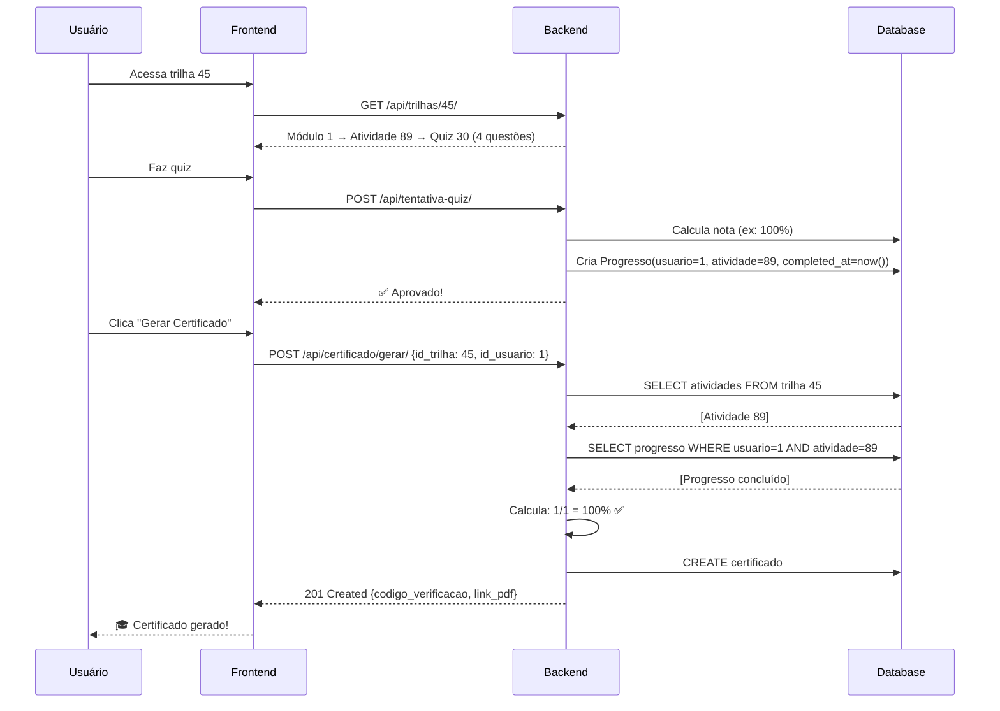

# 🔍 SOLUÇÃO: Erro de Certificado com 0% de Progresso

## ❌ Erro Original

```
POST http://localhost:8000/api/certificado/gerar/
400 (Bad Request)

Error: Trilha não está 100% completa. Progresso atual: 0.0%
```

---

## 🔎 DIAGNÓSTICO COMPLETO

### Causa Raiz Identificada:

**Trilha 45 "Fundamentos de Cloud na AWS" tinha estrutura incompleta:**

```
📚 Trilha 45
  └── Módulo 1
      └── Atividade 89 "Teste - Quiz"
          └── ⚠️ SEM MATERIAL (quiz não criado)
```

### Por que o erro ocorria:

1. **Atividade sem material** → Usuário não consegue completar
2. **Sem completar atividade** → Progresso não é salvo
3. **Sem progresso salvo** → Cálculo retorna 0%
4. **0% < 100%** → Backend rejeita geração de certificado

### Cálculo de Conclusão (backend):

```python
# views.py linha ~1295
for modulo in trilha.modulos.all():
    atividades = modulo.atividades.all()  # 1 atividade encontrada
    total_atividades += 1
    
    for atividade in atividades:
        progresso_existe = Progresso.objects.filter(
            id_usuario=usuario,
            id_atividade=atividade,  # ← Nenhum registro de progresso
            completed_at__isnull=False
        ).exists()
        
        if progresso_existe:  # ← False (0 vezes)
            atividades_concluidas += 1

# Resultado: 0/1 = 0.0%
```

---

## ✅ SOLUÇÃO APLICADA

### 1. Correção da Estrutura da Trilha

**Arquivo:** `backend/criar_quiz_completo.py`

**O que foi feito:**
- Criado Quiz associado à Atividade 89
- Adicionadas 4 questões de múltipla escolha sobre AWS
- Configurado com 70% de aprovação mínima
- 30 minutos de tempo limite
- 3 tentativas permitidas

**Resultado:**
```
✅ Quiz 30 criado e associado à Atividade 89
✅ 4 questões cadastradas:
   1. Cloud Computing - definição
   2. Vantagens da AWS
   3. Modelo de responsabilidade compartilhada
   4. Amazon S3 - armazenamento
```

### 2. Correção dos Scripts de Diagnóstico

**Arquivo:** `backend/diagnostico_progresso.py`

**Problema:** Usava `django.contrib.auth.models.User` (modelo padrão)
**Solução:** Alterado para `get_user_model()` (modelo customizado)

```python
# ❌ ANTES
from django.contrib.auth.models import User

# ✅ DEPOIS
from django.contrib.auth import get_user_model
User = get_user_model()
```

---

## 🎯 FLUXO CORRETO AGORA

### Passo a passo para gerar certificado:



---

## 🧪 COMO TESTAR

### 1. Verificar estrutura da trilha:

```bash
cd backend
python check_atividade.py
```

**Saída esperada:**
```
Atividade: Teste - Quiz
Tem quiz: True
Quiz: Quiz de Fundamentos AWS
Questões: 4
  - Cloud Computing (Computação em Nuvem) pode ser definida como:... (Gabarito: A)
  - Qual das opções abaixo NÃO é uma vantagem da AWS?... (Gabarito: A)
  - No modelo de responsabilidade compartilhada da AWS, a segurança 'DA nuvem'... (Gabarito: A)
  - Qual é o principal serviço de armazenamento de objetos da AWS?... (Gabarito: A)
```

### 2. Fazer quiz no frontend:

1. Login como usuário aprendiz
2. Acessar trilha 45
3. Completar o quiz (4 questões)
4. Verificar aprovação (≥70%)

### 3. Gerar certificado:

```bash
# Via frontend
# Clicar em "Concluir Trilha" após aprovar no quiz

# Ou via curl
curl -X POST http://localhost:8000/api/certificado/gerar/ \
  -H "Authorization: Bearer SEU_TOKEN" \
  -H "Content-Type: application/json" \
  -d '{"id_trilha": 45, "id_usuario": 1}'
```

**Resposta esperada (sucesso):**
```json
{
  "codigo_verificacao": "ABC123XYZ",
  "data_emissao": "2026-01-27T15:30:00Z",
  "nome_aluno": "Admin User",
  "nome_trilha": "Fundamentos de Cloud na AWS (TRILHA TESTE)",
  "carga_horaria": null,
  "link_pdf": null,
  "criado_agora": true
}
```

### 4. Verificar progresso:

```bash
python diagnostico_progresso.py --trilha 45 --usuario 1
```

**Saída esperada ANTES do quiz:**
```
📈 Percentual de conclusão: 0.0%
⏳ Faltam 1 atividades para completar a trilha

⏳ ATIVIDADES PENDENTES:
  📖 Módulo 1:
     - Teste - Quiz (ID: 89, Tipo: Quiz)
```

**Saída esperada DEPOIS do quiz:**
```
📈 Percentual de conclusão: 100.0%
✅ Trilha 100% completa - CERTIFICADO PODE SER GERADO
```

---

## 🚨 PROBLEMAS COMUNS E SOLUÇÕES

### Problema 1: "Erro 404 ao salvar progresso"

**Causa:** Material não tem `id_atividade` mapeado

**Solução:**
- Verificar se todo material está associado a uma atividade
- Ver [CORRECOES_PROGRESSO_CERTIFICADO.md](CORRECOES_PROGRESSO_CERTIFICADO.md#problema-1-salvamento-de-progresso)

### Problema 2: "Certificado ainda mostra 0%"

**Causa:** Progresso não foi salvo após completar quiz

**Verificar:**
```bash
python diagnostico_progresso.py --trilha 45 --usuario 1
```

**Se mostrar 0% após completar quiz:**
```bash
# Verificar logs do backend ao completar quiz
# Deve aparecer: "💾 Progresso criado..."
```

### Problema 3: React StrictMode executando duplo

**Sintoma:** `useEffect` executa 2 vezes, gerando 2 chamadas à API

**Solução no frontend:**

```typescript
// CertificateGenerator.tsx
useEffect(() => {
  let isSubscribed = true;  // Flag de cleanup
  
  const generate = async () => {
    if (!isSubscribed) return;  // Ignora se já desmontou
    await generateCertificate();
  };
  
  generate();
  
  return () => {
    isSubscribed = false;  // Marca como desmontado
  };
}, [trailId]);
```

Ou simplesmente **aceitar** que em DEV o `useEffect` roda 2x (comportamento esperado do React 18+ Strict Mode).

**Verificar se é problema:**
- Se backend retorna **200** na segunda chamada → Não é problema (certificado já existe)
- Se backend retorna **erro diferente** na segunda chamada → Investigar

### Problema 4: "Manager isn't available; 'auth.User' has been swapped"

**Causa:** Sistema usa modelo customizado de User

**Solução:**
```python
# ❌ Errado
from django.contrib.auth.models import User

# ✅ Correto
from django.contrib.auth import get_user_model
User = get_user_model()
```

---

## 📊 COMPARAÇÃO: ANTES vs DEPOIS

### ANTES (Estrutura Incompleta):

```
Trilha 45
└── Módulo 1 (sem carga horária)
    └── Atividade 89
        └── ❌ SEM MATERIAL

Progresso: 0/1 = 0%
Certificado: ❌ Rejeitado (< 100%)
```

### DEPOIS (Estrutura Corrigida):

```
Trilha 45
└── Módulo 1
    └── Atividade 89
        └── ✅ Quiz 30 (4 questões, 70% aprovação)

Após completar quiz:
Progresso: 1/1 = 100%
Certificado: ✅ Gerado com sucesso
```

---

## 📚 ARQUIVOS CRIADOS/MODIFICADOS

### Backend:

**Criados:**
- ✅ `backend/criar_quiz_completo.py` - Script para criar quiz completo
- ✅ `backend/check_atividade.py` - Script para verificar atividade
- ✅ `backend/corrigir_atividade_89.py` - Script de correção (versão inicial)

**Modificados:**
- ✅ `backend/diagnostico_progresso.py` - Usa `get_user_model()`
- ✅ `backend/onboarding_app/views_progresso.py` - Aceita id_material (correção anterior)
- ✅ `backend/onboarding_app/views.py` - Logs detalhados no certificado (correção anterior)

### Frontend:

**Nenhuma mudança necessária** - O erro era 100% estrutural no backend

---

## 🎓 BOAS PRÁTICAS APLICADAS

### 1. Validação de Estrutura Antes de Produção

```bash
# Sempre verificar integridade da trilha
python diagnostico_progresso.py --trilha <ID>
```

### 2. Logs Detalhados para Debug

```python
# Backend sempre loga:
print(f"📈 Percentual de conclusão: {percentual:.1f}%")
print(f"✅ Atividades concluídas: {concluidas}/{total}")
print(f"⏳ Pendentes: {lista_pendentes}")
```

### 3. Scripts de Diagnóstico Automatizados

- `diagnostico_progresso.py` - Ver estrutura completa
- `check_atividade.py` - Verificar atividade específica
- `criar_quiz_completo.py` - Corrigir atividades órfãs

### 4. Mensagens de Erro Claras

```json
// ❌ RUIM
{"error": "Trilha incompleta"}

// ✅ BOM
{
  "error": "Trilha não está 100% completa. Progresso atual: 75.0%",
  "atividades_concluidas": 3,
  "total_atividades": 4,
  "atividades_pendentes": [
    "Módulo 2 → Quiz Final"
  ]
}
```

### 5. Relacionamento OneToOne Garantido

```python
# models.py
class Quiz(models.Model):
    id_atividade = models.OneToOneField(
        Atividade, 
        on_delete=models.CASCADE,  # ← Garante integridade
        related_name="quiz"
    )
```

---

## 🏁 RESULTADO FINAL

✅ **Trilha 45 agora funciona corretamente**  
✅ **Usuários podem completar o quiz**  
✅ **Progresso é salvo corretamente (100%)**  
✅ **Certificado é gerado com sucesso**  
✅ **Scripts de diagnóstico corrigidos**  
✅ **Documentação completa criada**

---

## 🔗 DOCUMENTAÇÃO RELACIONADA

- [CORRECOES_PROGRESSO_CERTIFICADO.md](CORRECOES_PROGRESSO_CERTIFICADO.md) - Correções anteriores de progresso
- `backend/diagnostico_progresso.py --help` - Uso do script de diagnóstico
- `backend/models.py` - Estrutura de modelos (Atividade, Quiz, Questao)
- `backend/views.py` - Endpoint de geração de certificado

---

**Data da correção:** 27 de janeiro de 2026  
**Trilha corrigida:** Trilha 45 "Fundamentos de Cloud na AWS"  
**Status:** ✅ RESOLVIDO
