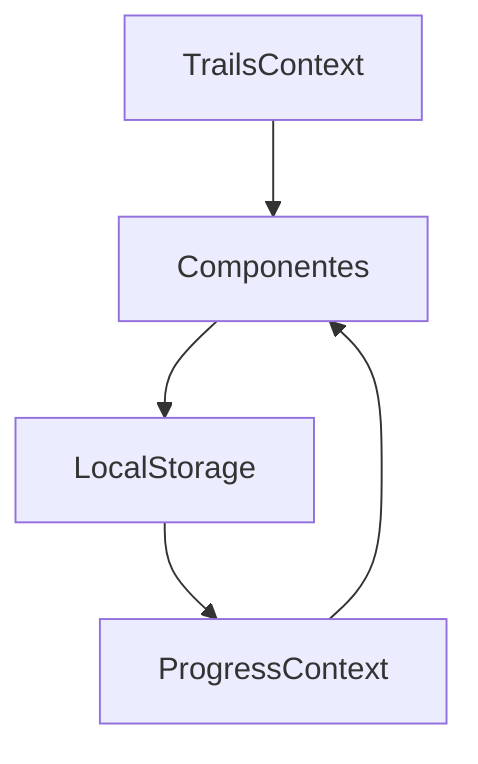
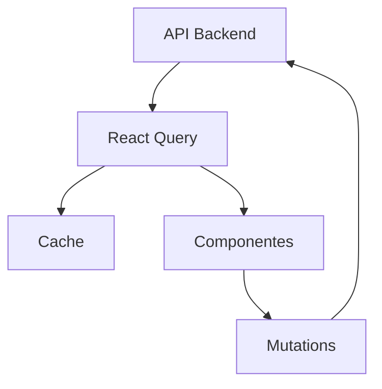

# 📚 DOCUMENTAÇÃO DETALHADA DA ARQUITETURA FRONTEND

## 🏗️ VISÃO GERAL DA ARQUITETURA

O frontend foi desenvolvido com uma arquitetura modular e escalável, preparada para integração com backend Django/PostgreSQL.

### 📦 STACK TECNOLÓGICA

```typescript
// Core Framework
React 18+              // Biblioteca base com Concurrent Features
TypeScript             // Tipagem estática e IntelliSense
Vite                  // Build tool rápido e moderno

// Roteamento e Estado
React Router v6       // Navegação SPA
Context API           // Estado global (será migrado para React Query)

// Estilização
Tailwind CSS          // Framework CSS utility-first
CSS Modules           // Estilos componetizados

// Ferramentas (preparadas)
Axios                 // Cliente HTTP com interceptors
React Query           // Cache e sincronização de estado da API
```

## 🎯 PADRÕES DE DESIGN IMPLEMENTADOS

### 1. **Separation of Concerns**
```
├── /components        # UI Components puros
├── /contexts         # Estado global e lógica de negócio
├── /services         # Comunicação com API
├── /types           # Definições TypeScript
├── /hooks           # Lógica reutilizável
└── /utils           # Funções auxiliares
```

### 2. **Component Composition**
```typescript
// Componentes compostos para flexibilidade
<TrailViewer>           // Container principal
  <Sidebar>             // Navegação
    <ModuleList>        // Lista de módulos
      <MaterialList>    // Lista de materiais
    </ModuleList>
  </Sidebar>
  <ContentArea>         // Área principal
    <MaterialViewer>    // Renderizador polimórfico
  </ContentArea>
</TrailViewer>
```

### 3. **Polymorphic Rendering**
```typescript
// MaterialViewer renderiza diferentes tipos baseado em props
switch (material.type) {
  case 'video': return <VideoPlayer />
  case 'pdf': return <PDFViewer />
  case 'quiz': return <QuizEngine />
  case 'reading': return <TextContent />
}
```

### 4. **Context Pattern**
```typescript
// Estado global com providers hierárquicos
<TrailsProvider>        // Dados das trilhas
  <ProgressProvider>    // Progresso do usuário
    <AuthProvider>      // Autenticação (preparado)
      <App />
    </AuthProvider>
  </ProgressProvider>
</TrailsProvider>
```

## 🔄 FLUXO DE DADOS

### Estado Atual (Context API)


### Estado Futuro (React Query)


## 🧩 COMPONENTES PRINCIPAIS

### 1. **MaterialViewer** - Motor de Renderização
```typescript
/**
 * RESPONSABILIDADES:
 * - Renderização polimórfica baseada em tipo
 * - Sistema de progresso integrado
 * - Quiz engine completo
 * - Player de vídeo com controles
 * - Persistência automática
 */

// TIPOS SUPORTADOS
'video'    -> VideoPlayer com progresso tracking
'pdf'      -> PDFViewer com iframe
'reading'  -> TextContent formatado
'quiz'     -> QuizEngine com pontuação
```

### 2. **TrailViewer** - Navegador de Trilha
```typescript
/**
 * FUNCIONALIDADES:
 * - Layout responsivo com sidebar
 * - Sistema de resumo automático
 * - Navegação sequencial/não-sequencial
 * - Progresso visual
 * - Controles de navegação
 */

// ESTADOS PRINCIPAIS
currentModuleIndex     // Módulo atual
currentMaterialIndex   // Material atual
completedMaterials     // Set de IDs completados
sidebarCollapsed      // UI responsiva
```

### 3. **QuizEngine** - Sistema de Avaliação
```typescript
/**
 * CARACTERÍSTICAS:
 * - Embaralhamento de perguntas/opções
 * - Timer por pergunta e total
 * - Múltiplas tentativas
 * - Tela de revisão sem gabarito
 * - Cálculo automático de pontuação
 * - Feedback com explicações
 */

// FLUXO DO QUIZ
Início -> Perguntas -> Revisão -> Resultados -> Finalização
```

## 📊 SISTEMA DE PROGRESSO

### Estrutura de Dados
```typescript
interface UserProgress {
  userId: number
  trailProgress: {
    [trailId: number]: {
      moduleProgress: {
        [moduleId: number]: {
          materialProgress: {
            [materialId: number]: {
              completed: boolean
              score?: number
              timeSpent: number
              lastPosition?: number  // Para vídeos
            }
          }
        }
      }
      lastModule: number        // Resumo automático
      lastMaterial: number
      overallProgress: number   // Porcentagem total
    }
  }
}
```

### Persistência
- **Atual**: localStorage com JSON
- **Futuro**: Backend + localStorage como cache

## 🎨 SISTEMA DE UI/UX

### Design System
```scss
// Cores Principais
$primary: #233E97      // Azul FAURG
$secondary: #F59E0B    // Laranja
$success: #10B981      // Verde
$error: #EF4444        // Vermelho

// Breakpoints Responsivos
sm: 640px    // Mobile
md: 768px    // Tablet
lg: 1024px   // Desktop
xl: 1280px   // Wide Desktop
```

### Animações
```css
/* Micro-interactions para feedback visual */
.animate-fadeIn        /* Fade suave para novos elementos */
.animate-slideInUp     /* Cards e modais */
.animate-slideInDown   /* Dropdowns e menus */
.hover:scale-102       /* Hover em botões */
```

## 🔐 SISTEMA DE AUTENTICAÇÃO (Preparado)

### Fluxo JWT
```typescript
// 1. Login
POST /api/auth/login/
Response: { access, refresh, user }

// 2. Interceptor automático
axios.interceptors.request.use(config => {
  config.headers.Authorization = `Bearer ${token}`
})

// 3. Refresh automático
axios.interceptors.response.use(null, async error => {
  if (error.status === 401) {
    await refreshToken()
    return retryRequest(error.config)
  }
})
```

### Proteção de Rotas
```typescript
// Higher-Order Component para rotas protegidas
const ProtectedRoute = ({ children }) => {
  const { isAuthenticated } = useAuth()
  return isAuthenticated ? children : <Redirect to="/login" />
}
```

## 📈 PERFORMANCE E OTIMIZAÇÃO

### Strategies Implementadas
```typescript
// 1. Code Splitting por rota
const AdminDashboard = lazy(() => import('./components/AdminDashboard'))

// 2. Memoização de componentes pesados
const ExpensiveComponent = memo(({ data }) => {
  return <ComplexVisualization data={data} />
})

// 3. Virtual Scrolling (para listas grandes)
const VirtualizedList = ({ items }) => {
  return <FixedSizeList height={400} itemCount={items.length} />
}

// 4. Image optimization

```

### Cache Strategy
```typescript
// React Query configurado para:
staleTime: 5 minutes        // Dados válidos por 5 min
gcTime: 10 minutes          // Cache por 10 min após unused
refetchOnWindowFocus: true  // Refetch ao focar janela
refetchOnReconnect: true    // Refetch ao reconectar
```

## 🧪 TESTING STRATEGY (Preparada)

### Estrutura de Testes
```typescript
// 1. Unit Tests - Componentes isolados
describe('MaterialViewer', () => {
  test('renders video player for video material', () => {
    render(<MaterialViewer material={{ type: 'video' }} />)
    expect(screen.getByRole('video')).toBeInTheDocument()
  })
})

// 2. Integration Tests - Fluxos completos
test('user can complete a quiz and see results', async () => {
  // Simular fluxo completo de quiz
})

// 3. E2E Tests - Cypress
cy.visit('/trail/1')
cy.get('[data-testid="start-quiz"]').click()
cy.get('[data-testid="option-0"]').click()
cy.get('[data-testid="finish-quiz"]').click()
cy.contains('Score: 100%').should('be.visible')
```

## 📱 RESPONSIVE DESIGN

### Mobile-First Approach
```typescript
// Breakpoints utilizados
const Layout = () => {
  return (
    <div className="
      flex flex-col              // Mobile: stack vertical
      lg:flex-row               // Desktop: layout horizontal
      w-full                    // Full width sempre
      h-screen                  // Full height
    ">
      <Sidebar className="
        w-full                  // Mobile: full width
        lg:w-80                // Desktop: fixed width
        border-b               // Mobile: border bottom
        lg:border-b-0          // Desktop: no bottom border
        lg:border-r            // Desktop: border right
      " />
      
      <Content className="
        flex-1                 // Take remaining space
        overflow-auto          // Scroll interno
        p-4                   // Padding responsivo
        lg:p-6                // Maior no desktop
      " />
    </div>
  )
}
```

### Touch Interactions
```typescript
// Gestos e interactions mobile
const SwipeableQuiz = () => {
  const handlers = useSwipeable({
    onSwipedLeft: () => nextQuestion(),
    onSwipedRight: () => prevQuestion(),
    preventDefaultTouchmoveEvent: true,
    trackMouse: true  // Funciona no desktop também
  })

  return <div {...handlers}>Quiz Content</div>
}
```

## 🔄 MIGRATION PATH (Context -> React Query)

### Fase 1: Preparação
```typescript
// ✅ DONE: Criar services e hooks
// ✅ DONE: Configurar QueryClient
// ✅ DONE: Definir interfaces TypeScript

// TODO: Instalar providers
<QueryProvider>
  <AuthProvider>
    <ErrorProvider>
      <App />
    </ErrorProvider>
  </AuthProvider>
</QueryProvider>
```

### Fase 2: Migração Gradual
```typescript
// Antes (Context)
const { trails, addTrail } = useTrails()

// Depois (React Query)
const { data: trails } = useTrails()
const addTrailMutation = useCreateTrail()
```

### Fase 3: Backend Integration
```typescript
// Substituir dados mockados por API real
const { data: trails } = useQuery({
  queryKey: ['trails'],
  queryFn: () => trailService.getTrails(),
  staleTime: 5 * 60 * 1000  // 5 minutos
})
```

## 🚀 DEPLOYMENT STRATEGY

### Build Optimization
```typescript
// vite.config.ts
export default defineConfig({
  build: {
    rollupOptions: {
      output: {
        manualChunks: {
          vendor: ['react', 'react-dom'],
          router: ['react-router-dom'],
          ui: ['@headlessui/react', '@heroicons/react']
        }
      }
    },
    target: 'es2020',
    minify: 'terser'
  }
})
```

### Environment Configuration
```bash
# .env.production
VITE_API_BASE_URL=https://api.faurg.edu.br
VITE_CDN_URL=https://cdn.faurg.edu.br
VITE_ANALYTICS_ID=ga-xxx-xxx
VITE_SENTRY_DSN=https://sentry.io/xxx
```

---

Esta arquitetura foi projetada para ser **escalável**, **manutenível** e **performática**, com foco na experiência do usuário e facilidade de desenvolvimento. 🎯